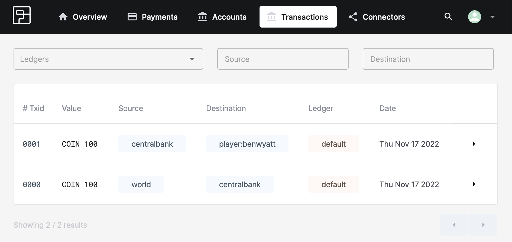
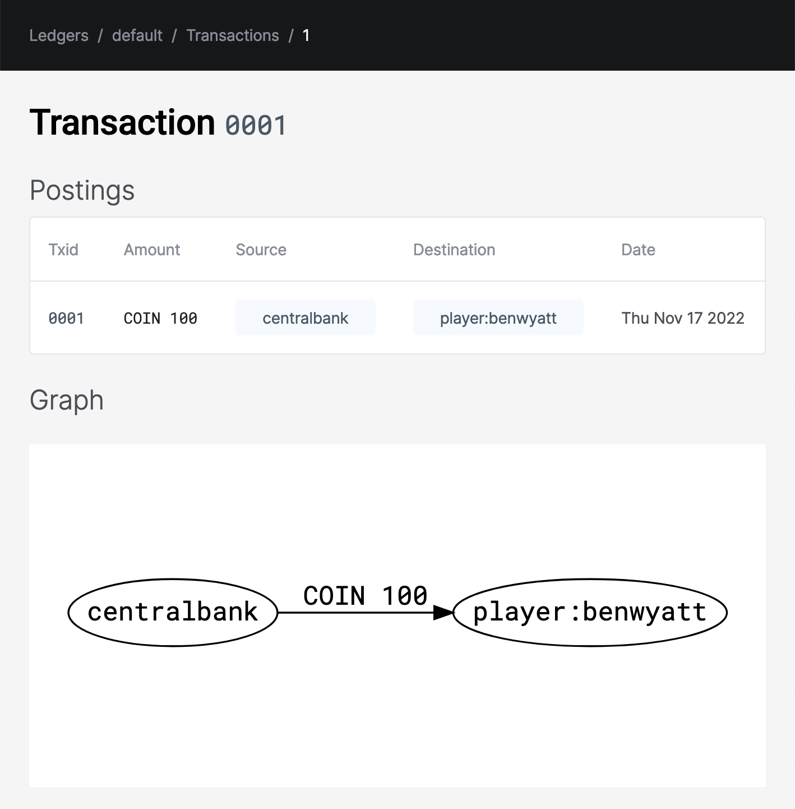

# Your first transaction.

OK, we've created some coin in Dunshire's central bank. Now it's time to put it to work. When players sign up for our game, they start with a modest sum of coin to help them out. And we've just gotten our first player, `benwyatt`! Let's get them some coin.

## Describing the transaction with Numscript

Just like before, we're going to use a bit of Numscript to describe the transfer of 100 coin from our central bank to our fist player.

Create a file called `first.num` with the following Numscript:

```numscript
send [COIN 100] (
  source = @centralbank
  destination = @player:benwyatt
)
```

This transaction looks a lot like the one we created earlier:

* `[COIN 100]` means we want to send 100 coins. You can send money in whatever currency makes sense for your use case. Very often this will be `USD` or `EUR`. (We'll talk more about sending fractions of a unit of currency in a bit).

* `source = @centralbank` means the source of the money is the central bank of Dunshire.

* `destination = @player:benwyatt` means the money should go to our first player, `benwyatt`.

:::info

Account names can contain symbols like `:`, and so we are using the convention `@namespace:owner` to create namespaces in our account names. In this case, the account name indicates that it belongs to a player whose in-game username is `benwyatt`. Of course, you can adopt other conventions as suits your particular needs.

:::

## Executing the Numscript

Once again, we have our transaction described with Numscript, and we are going to execute it against the `dunshire` ledger.

```shell
fctl ledger transactions num first.num
```

You should see this in response:

```
ID        | 1
Reference |
Date      | 2022-11-17T11:33:51Z

Source      | Destination     | Asset | Amount
centralbank | player:benwyatt | COIN  | 100

Account         | Asset | Movement | Final balance
centralbank     | COIN  | -100     | 0
player:benwyatt | COIN  | +100     | 100

Metadata : <empty>
```

And if you visit the Formance dashboard to verify the transaction, clicking on the transactions tab will show:



Which shows that the new transaction has been added to the ledger. Click on the `▸` icon next to transaction ID `1` to dig a little deeper:



## What happens if we execute it twice?

The transaction described in `first.num` can be executed more than once. Let's say we want to send another 100 coin to account `@player:benwyatt`. We can just execute the same Numscript again. Give it a try:

```shell
fctl ledger transactions num first.num
```

This time, however, we get a different result:
```
  ERROR   account had insufficient funds
```

That's because `@centralbank` had only 100 coin in it to begin with, and we'd already transferred all of that out.

:::info
Accounts in Formance Ledger cannot go negative! (Except for the special `@world` account).
:::

:::info
Transactions described in Numscript are **not** idempotent by default. Executing the same transaction twice tells Formance Ledger to make two distinct transfers.
:::

## Congratulations

You've now seen the basics of Formance Ledger, and you can:

* Introduce money into a ledger using the special `@world` account
* Create and transfer money between accounts using Numscript
* Check account existence, balances, and transaction histories using the built-in dashboard

But Formance Ledger is capable of so much more. To continue learning about all the things Formance Ledger can do, we're prepared a set of [guides to Numscript](/ledger/numscript/), each building upon what you've learned here, and each covering a specific topic.
