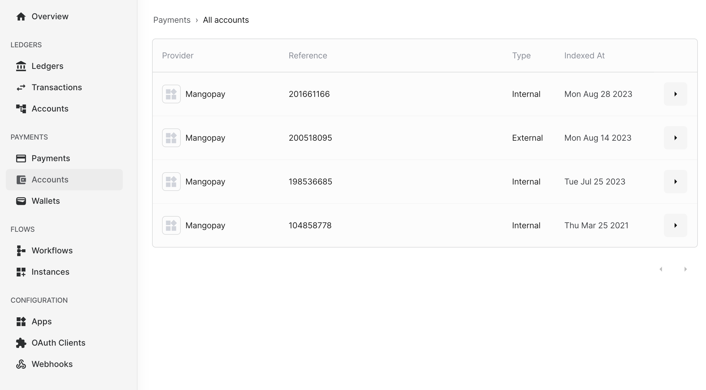
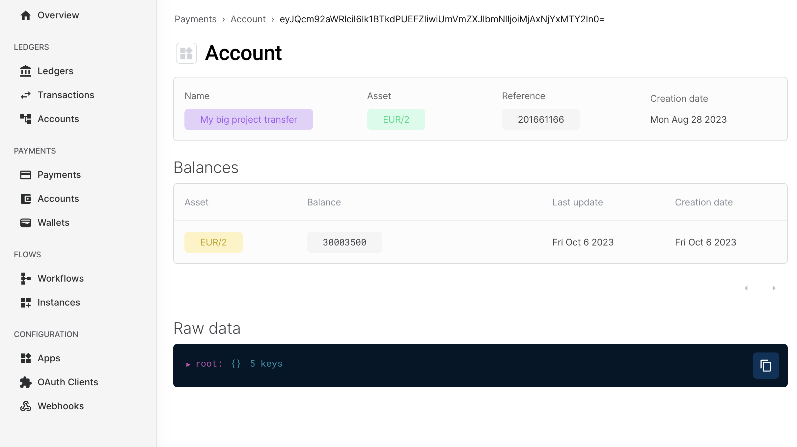

Accounts on the Payments service are representations of a user's accounts on the
associated payment provider. These accounts serve as a bridge between the user
and the payment provider, viewing transaction history, making payments with a
few clicks and ensuring a secure and reliable payment experience. Overall,
accounts on the Payments service play a crucial role in simplifying and
enhancing the user's payment journey, making it more convenient, efficient, and
secure.

An account on the Formance platform is represented by various fields, each
serving a specific purpose. These fields include:

- ID: This unique identifier is used to distinguish the account within the
Payments service.
- Reference: The account reference on the payments provider, which helps link it
to the appropriate transactions.
- Provider: The payment provider associated with the account
- Type: This field indicates the type of the account, which can be either
INTERNAL or EXTERNAL (c.f. below)
- CreatedAt: This field displays the date and time of the account's creation on
the payments provider, allowing users to track the account's history.
- DefaultAsset: While optional, this field allows users to specify a default
asset for the account, streamlining transactions and providing convenience.
- AccountName: Also optional, this field enables users to assign a name to the
account, making it easier to identify and manage.

By including these fields, the Formance platform offers a comprehensive and
flexible account management system, catering to the diverse needs of its users.

## How to fetch and see accounts list

### Formance console

On the Formance Console, you can easily access the complete list of accounts by
simply clicking on the `Accounts` tab located on the left-hand side of the menu.
This intuitive interface allows you to conveniently view all the necessary
information related to each account with just a few clicks.

By clicking on the `View` button situated on the right side of each account, you
can delve deeper into the details of that specific account. This provides you
with a comprehensive overview of the account, including essential information
such as the default asset associated with it and the current balance.

With this user-friendly feature, you can effortlessly navigate through the
Formance Console and gain a thorough understanding of your accounts, enabling
you to make informed decisions based on the detailed information provided.





### API

You can also use the API to fetch the list of accounts using FCTL.

```shell
fctl payments accounts list
```

If all goes well, you should see:

```
ID                     | AccountName | CreatedAt            | ConnectorID       | DefaultAsset | DefaultCurrency | Reference | Type
<Internal Formance ID> | Name 1      | 2023-08-28T09:58:34Z | <ConnectorID>     | EUR/2        | EUR/2           | Ref1      | INTERNAL
<Internal Formance ID> | Name 2      | 2023-08-14T09:26:07Z | <ConnectorID>     |              |                 | Ref2      | EXTERNAL
<Internal Formance ID> | Name 3      | 2023-07-25T11:48:44Z | <ConnectorID>     | USD/2        | USD/2           | Ref3      | INTERNAL
<Internal Formance ID> | Name 4      | 2021-03-25T15:11:17Z | <ConnectorID>     | EUR/2        | EUR/2           | Ref4      | INTERNAL
```

In order to fetch the details of a specific account, you can use the following
fctl command:

```shell
fctl payments accounts get <Internal Formance ID>
```

If all goes well, you should see:

```
# Information
ID              | <Internal Formance ID>
AccountName     | Name 1
CreatedAt       | 2023-08-28T09:58:34Z
ConnectorID     | <ConnectorID>
DefaultAsset    | EUR/2
Reference       | Ref1
Type            | INTERNAL
```

## Internal Accounts

An INTERNAL account, which refers to a user's digital e-wallet, serves as a
secure storage for funds within the payments provider environment.

In addition to its primary purpose, an INTERNAL account offers versatile
functionality, allowing users to perform the following actions:

1. Transfer funds from one INTERNAL account to another INTERNAL account (Transfer)
2. Withdraw funds from an INTERNAL account to an EXTERNAL account (Payout)

These features provide users with flexibility and convenience when managing
their finances within the platform.

## External Accounts

Accounts with the type 'EXTERNAL' represent actual bank accounts of the user and
are required for the following purposes:

- Facilitating the transfer of funds from an INTERNAL account to an EXTERNAL
account (referred to as a "Payout").

Please note that at this time, it is not yet possible to move funds from an
EXTERNAL account to an INTERNAL account.

It is important to ensure that users have an active EXTERNAL account in order
to successfully execute a Payout. This allows for the seamless transfer of funds
from the user's INTERNAL account to their designated EXTERNAL account.

By having an EXTERNAL account, users can easily manage and control their
finances by securely moving funds between different accounts. This feature
provides greater flexibility and convenience for users to access and utilize
their funds in a manner that suits their individual needs.

We are continuously working to enhance our platform and are actively exploring
options to support the movement of funds from EXTERNAL accounts to INTERNAL
accounts. Stay tuned for future updates and developments in this area.

### External Accounts creation

You can utilize Formance's Payments service to effortlessly create EXTERNAL accounts on the various associated
providers. These providers include beneficiaries and recipient accounts,
depending on the specific providers you choose.

Please keep in mind that currently, only Banking Circle is supported by the
system. However, we are continuously working on expanding our supported
providers to offer you more options in the future.

In order to create an External Account, you can only do it via the API for
the moment while waiting for the Formance Console to be updated.

```shell
fctl payments bank_accounts create bank_account.json
```

With bank_account.json containing:

```json
{
    "name": "My Bank Account",
    "provider": "BANKING-CIRCLE",
    "country": "FR",
    "iban": "FR1420041010050500013M02606",
    "swiftBicCode": "PSSTFRPPMON",
    "accountNumber": "0500013M026",
}
```

Please note that in order to complete the transaction, you will need to provide
the following details: the name of the bank account, the name of the payments
provider, the country where the account is held, the International Bank Account
Number (IBAN), and the swiftBicCode. Alternatively, you may also provide only
the account number if the other details are not available.
