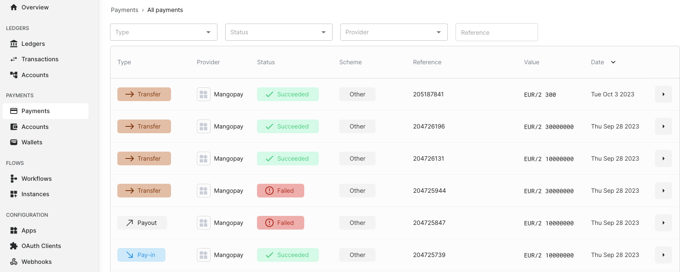
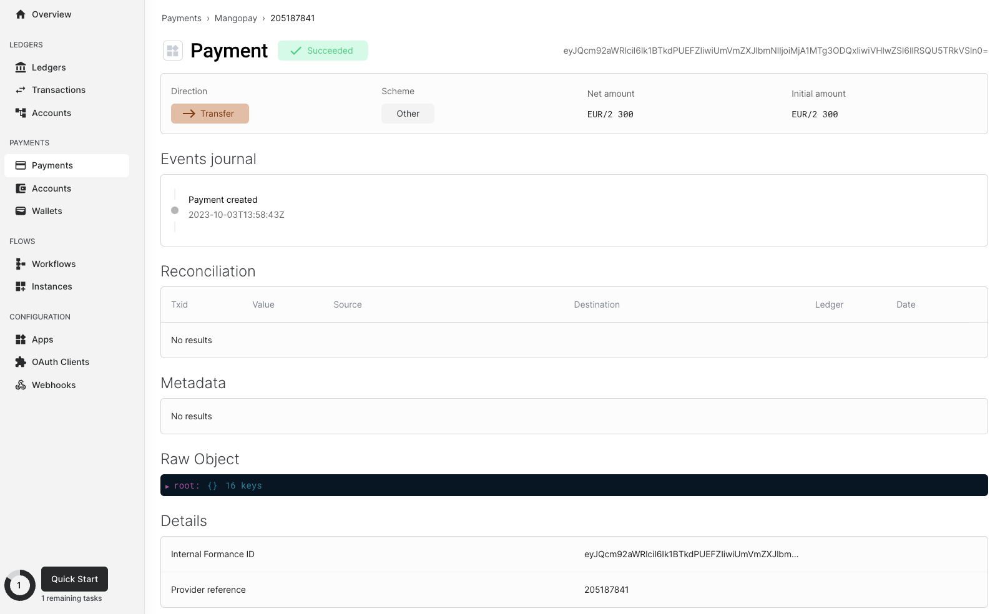

Payments are the core part of this service. It represents moving funds between
accounts on the payments provider.

A payment is composed of several key elements. Firstly, there is an ID internal
to formance. This ID is used to identify the payment within the formance
payments service and to perform various actions related to it.

Secondly, there is a reference ID. This is the ID of the payment on the payments
provider platform or internal system.

Next, we have the source account ID and the destination account ID. These IDs
are specific to formance accounts and are linked to this particular payment.
They help in specifying the origin and destination of the funds involved in the
payment.

The type of payment is another important aspect. It can be categorized as PAYIN,
TRANSFER, or PAYOUT, depending on the nature and purpose of the payment.

Furthermore, there is the provider associated with the payment. This refers to
the entity or service provider through which the payment is processed. It could
be a bank, a payment gateway, or any other financial institution.

The status of the payment is another vital piece of information. It can be one
of the following: PENDING, SUCCEEDED, FAILED, or CANCELED. This status indicates
the current stage or outcome of the payment transaction.

Additionally, we have the InitialAmount and the asset representing the amount
and currency. These are represented using the Unambiguous Monetary Notation
(UMN), which ensures clarity and consistency in monetary values.

The schema of the payment is also included. For example, it could be Mastercard,
Visa, or any other payment scheme or network associated with the payment.

The creation date of the payment provides information about when the payment was
initiated or created within the system.

Finally, there is the Raw payload sent by the payments provider. This refers to
the original data or information sent by the provider, which may include
additional details or specifications related to the payment.

## How to fetch and see payments list

### Formance console

On the Formance Console, you have access to a comprehensive list of payments.
To view this list, simply navigate to the Payments tab located on the left side
of the screen. By doing so, you will be presented with a neatly organized table
showcasing all the payments.

To make it easier for you to find specific payments, you have the option to
apply various filters. You can filter the list by Type, allowing you to focus
on Payin, Payout, or transfer transactions. Additionally, you can filter by
Status, enabling you to narrow down the results to payments that are either
PENDING, SUCCEEDED, FAILED, or CANCELED. If you prefer, you can also search for
payments based on the provider name or the payments provider reference.

Furthermore, by clicking on any payment within the list, you can access detailed
information about that specific payment. This allows you to delve deeper into
the specifics and gain a better understanding of each transaction.





### API

You can also use the API to fetch the list of payments using FCTL.

```shell
fctl payments payments list
```

If all goes well, you should see:

```
ID                      | Type     | Amount    | Asset | Status    | Scheme            | Reference | Source Account ID     | Destination Account ID | ConnectorID    | Created at
<Formance Internal ID>  | TRANSFER | 300       | EUR/2 | SUCCEEDED | <Payment Scheme>  | Ref1      | <Formance Account ID> | <Formance Account ID>  | <ConnectorID>  | 2023-10-03T13:58:43Z
<Formance Internal ID>  | TRANSFER | 30000000  | EUR/2 | SUCCEEDED | <Payment Scheme>  | Ref2      | <Formance Account ID> | <Formance Account ID>  | <ConnectorID>  | 2023-09-28T12:45:15Z
<Formance Internal ID>  | TRANSFER | 10000000  | EUR/2 | SUCCEEDED | <Payment Scheme>  | Ref3      | <Formance Account ID> | <Formance Account ID>  | <ConnectorID>  | 2023-09-28T12:44:52Z
<Formance Internal ID>  | TRANSFER | 30000000  | EUR/2 | FAILED    | <Payment Scheme>  | Ref4      | <Formance Account ID> | <Formance Account ID>  | <ConnectorID>  | 2023-09-28T12:43:36Z
<Formance Internal ID>  | PAYOUT   | 10000000  | EUR/2 | FAILED    | <Payment Scheme>  | Ref5      | <Formance Account ID> | <Formance Account ID>  | <ConnectorID>  | 2023-09-28T12:41:51Z
<Formance Internal ID>  | PAY-IN   | 10000000  | EUR/2 | SUCCEEDED | <Payment Scheme>  | Ref6      | <Formance Account ID> | <Formance Account ID>  | <ConnectorID>  | 2023-09-28T12:40:36Z
<Formance Internal ID>  | PAY-IN   | 10000000  | USD/2 | SUCCEEDED | <Payment Scheme>  | Ref7      | <Formance Account ID> | <Formance Account ID>  | <ConnectorID>  | 2023-09-28T12:40:05Z
<Formance Internal ID>  | TRANSFER | 100000000 | EUR/2 | FAILED    | <Payment Scheme>  | Ref8      | <Formance Account ID> | <Formance Account ID>  | <ConnectorID>  | 2023-09-28T12:39:15Z
<Formance Internal ID>  | PAY-IN   | 20000000  | EUR/2 | SUCCEEDED | <Payment Scheme>  | Ref9      | <Formance Account ID> | <Formance Account ID>  | <ConnectorID>  | 2023-09-28T12:37:46Z
<Formance Internal ID>  | TRANSFER | 100000000 | EUR/2 | FAILED    | <Payment Scheme>  | Ref10     | <Formance Account ID> | <Formance Account ID>  | <ConnectorID>  | 2023-09-28T12:36:01Z
<Formance Internal ID>  | TRANSFER | 100000000 | EUR/2 | FAILED    | <Payment Scheme>  | Ref11     | <Formance Account ID> | <Formance Account ID>  | <ConnectorID>  | 2023-09-28T12:35:17Z
<Formance Internal ID>  | TRANSFER | 100       | EUR/2 | SUCCEEDED | <Payment Scheme>  | Ref12     | <Formance Account ID> | <Formance Account ID>  | <ConnectorID>  | 2023-09-28T12:02:18Z
<Formance Internal ID>  | TRANSFER | 100       | EUR/2 | SUCCEEDED | <Payment Scheme>  | Ref13     | <Formance Account ID> | <Formance Account ID>  | <ConnectorID>  | 2023-09-28T10:35:12Z
<Formance Internal ID>  | TRANSFER | 100       | EUR/2 | SUCCEEDED | <Payment Scheme>  | Ref14     | <Formance Account ID> | <Formance Account ID>  | <ConnectorID>  | 2023-09-27T11:51:51Z
<Formance Internal ID>  | TRANSFER | 100       | EUR/2 | SUCCEEDED | <Payment Scheme>  | Ref15     | <Formance Account ID> | <Formance Account ID>  | <ConnectorID>  | 2023-09-27T11:50:41Z
```
