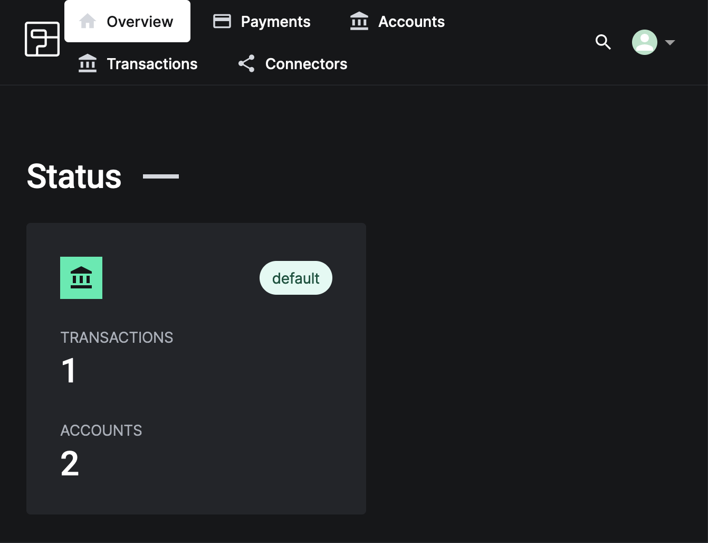
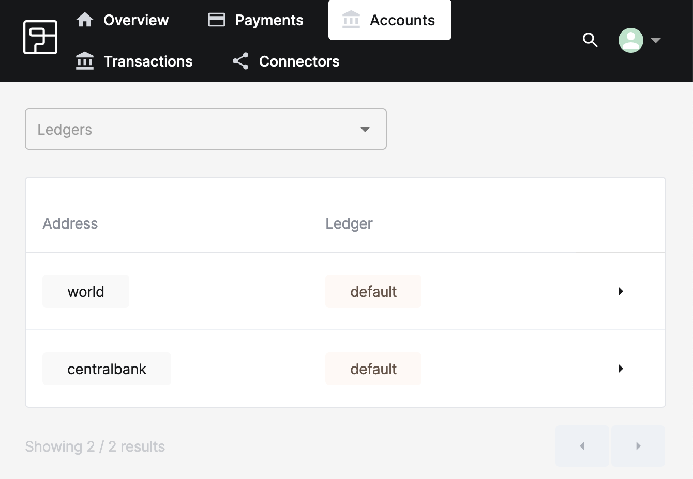
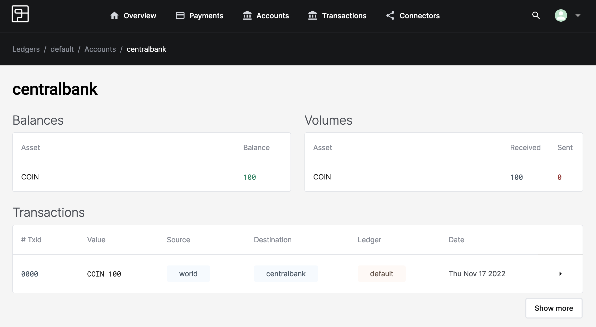

# Checking balances

In the previous step you introduced money into the `dunshire` ledger. Now we want to verify that everything is as it should be. We want to know: Did the `@centralbank` account get created, and does it have a balance of 100 coins?

To verify, you'll need to open the dashboard URI for your sandbox to see details on that account.

:::info
If you can't remember your sandbox domain just type
```shell
fctl stack show --name dunshire
```
to find it again.
:::

The dashboard landing page gives an overview of activity, and should look like this:



## Checking accounts

Clicking on the accounts tab at the top will take you to the accounts overview page. This page lists all the accounts Formance Ledger knows about. Right now, that should be only `@world` and `@centralbank`:



## Checking transactions and balances

Let's verify that `@centralbank` does indeed hold 100 coin transferred from `@world`. Click on `centralbank` to see detail on that account.



Here we can see that indeed, `@centralbank` holds a balance of 100 coin, and that it was received from `@world`. Perfect!

## Troubleshooting

### No accounts or different accounts

If you are seeing the dashboard, but it contains unexpected data, then you have probably already been experimenting with Formance Ledger, and don't have the right sandbox selected. Double check the URI in your browser against the output from

```shell
fctl stack show --name dunshire
```

## Next steps

Next, let's start handing out some coin to our players.
