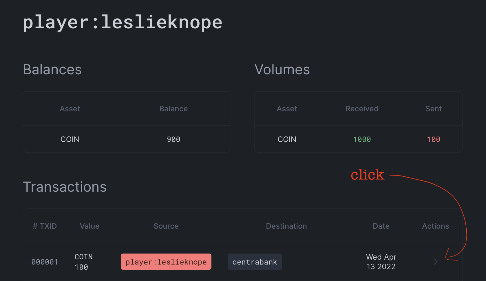

import Prerequisites from '@site/docs/ledger/partials/numscript/_prerequisites.mdx';
import Prereqwarn from '@site/docs/ledger/partials/numscript/_prereq_warning.mdx';


Sometimes you need to include more information with a transaction. For example:

* You want to associate a transaction with a specific purchase.
* You need to include a payment reference with the transaction.
* You want to include metadata to keep the ledger in sync with an external system.

<Prerequisites />

## Attaching transaction metadata

In the game land of Cones Dunshire, building cones is a central part of playing the game. As ledgerman, we want to keep track of how much players have spent on building cones for analytical reasons. We can do this by flagging transactions that represent spending on cone building, using metadata.

Player `leslieknope` just spent 100 coin to build a minor cone. Let's create that transaction, and flag it with metadata. Create a file called `metadata.num`:

```numscript
send [COIN 100] (
  source = @player:leslieknope
  destination = @centrabank
)
set_tx_meta("for_cone", "true")
set_tx_meta("cone_size", 15)

```

And run it with

```shell
fctl ledger transactions num metadata.num
```

<Prereqwarn />

Once you've run that transaction succesfully, let's have a look at `leslieknope`'s balance to find that transaction. It should be the topmost one listed. Click the details arrow to the right of the transaction to get more details.



On the transaction detail page, you'll find a snippet of JSON at the end that will look something like this:

```json
{
  "reference": "",
  "timestamp": "2022-04-13T07:10:12Z",
  "metadata": {
    "cone_size": {
      "type": "number",
      "value": 15
    },
    "for_cone": {
      "type": "string",
      "value": "true"
    }
  }
}
```

You can see the `metadata` field with the details of the information we added to the transaction.

### What's going on here?

Metadata is arbitrary data that you can attach to a transaction or an account. This data is typed, and can be a string or a number. You can retrieve (or even add to) this metadata later using the HTTP API, for integration into your own bespoke workflows.

## Attaching account metadata

You can also add metadata to an account during a transaction, like this:

```numscript
send [COIN 100] (
  source = @player:leslieknope
  destination = @centrabank
)
set_tx_meta("for_cone", "true")
set_tx_meta("cone_size", 15)
set_account_meta(@player:leslieknope, "overdraft", "false")

```


## Going further

Formance Ledger enables you to add metadata to accounts as well. This metadata can be utilized to create more complex transactions, incorporating variables that are bound to specific metadata during execution. For further information on this application, kindly consult the Numscript metadata [reference](/ledger/reference/numscript/metadata).
