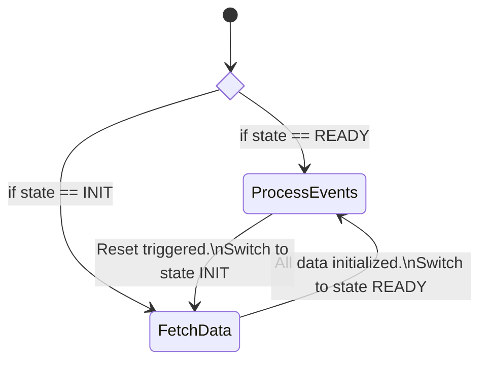

# Ingester

This component is dedicated to data ingestion on Formance modules.
It allows to create connectors (elasticsearch, clickhouse, ...), and create pipelines, plugging modules (ledger, payments...) on them.

# Modules requirements

The components must follow some guidelines to be able to be integrated with the ingester.
Each must : 
* have a /logs endpoint returning past logs in a normalized format
  > **_NOTE:_**  The endpoint must also support the cursors.
* push logs in a topic named `<stack>.<module name>` on the stack broker

The log is a json object containing following properties:

| Name | Description                       | Type | Required |
|-|-----------------------------------|-|-|
| id | The log id                        | string or bigint | Yes |
| date | The log date                      | string / rfc3339 | Yes |
| type | The log type. Defined by modules. | string | Yes |
| payload | The log payload. | object | Yes |
| shard | The log shard. Can be used to split data of the modules using modules business rules | Yes |

> **_NOTE:_**  The `shard` property allow to split logs of a modules. 
> The format of the field is defined by the modules and can be empty if not required.
> However, it must not be greater than 256 characters.

## Pipeline state diagram

## API Spec

See [Spec](./api/openapi.md)