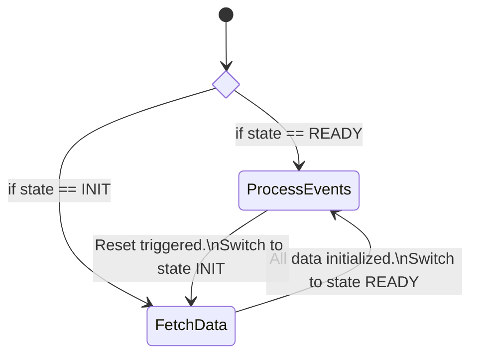

# Ingester

## Pipeline state diagram

```mermaid
stateDiagram-v2
    state if_state <<choice>>
    [*] --> if_state
    if_state --> ProcessEvents: if state == READY
    if_state --> FetchData: if state == INIT
    FetchData --> ProcessEvents: All data initialized.\nSwitch to state READY
    ProcessEvents --> FetchData: Reset triggered.\nSwitch to state INIT
```